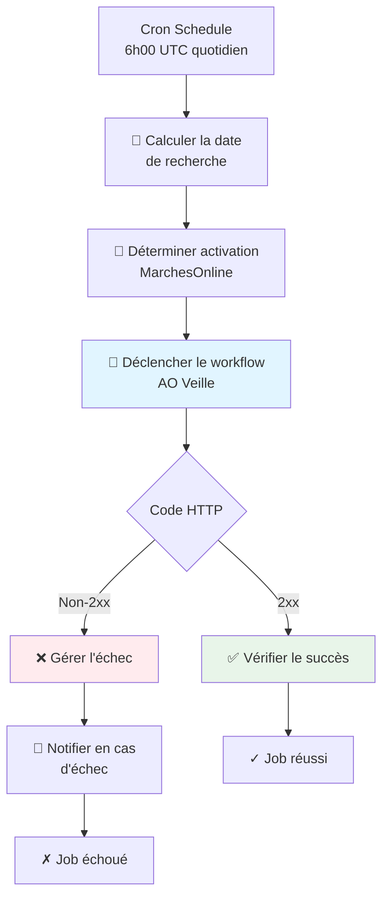

# 🤖 GitHub Workflow Quotidien - Documentation Technique

**Documentation complète du workflow GitHub Actions qui déclenche automatiquement la veille quotidienne AO.**

---

## 📋 Vue d'Ensemble

Le fichier `.github/workflows/daily-ao-veille.yml` est configuré pour :

- ✅ **Se déclencher automatiquement** chaque jour à 6h00 UTC (7h Paris hiver, 8h été)
- ✅ **Appeler l'API Mastra Cloud** pour lancer le workflow `aoVeilleWorkflow`
- ✅ **Gérer MarchesOnline** de manière intelligente (mercredi et vendredi uniquement)
- ✅ **Signaler les succès/échecs** de manière fiable sans faux positifs
- ✅ **Maintenir des logs lisibles** et une corrélation GitHub ↔ Mastra

---

## 🏗️ Architecture du Workflow



---

## 🎯 Principes de Design (Critical)

### Règle 1 : GitHub = Orchestration Uniquement

**GitHub Actions ne doit JAMAIS transporter de données métier lourdes.**

- ✅ **Rôle de GitHub** : Déclencher, vérifier le code HTTP, logguer le minimum
- ❌ **Pas le rôle de GitHub** : Stocker des gros JSON, faire du data pipeline

**Conséquence** :
- Les outputs GitHub contiennent uniquement des infos techniques courtes (`http_code`)
- Les données métier (détails de réponse Mastra) vivent dans les logs shell ou côté Mastra

### Règle 2 : Signal de Succès = 2xx HTTP

**Le succès GitHub dépend uniquement du code HTTP de l'appel Mastra.**

- ✅ **Succès** : Tout code HTTP `2xx` (200, 201, 202, 204…)
- ❌ **Échec** : Code HTTP `!= 2xx` (400, 401, 500, timeout…)

**Pourquoi 2xx et pas seulement 200** :
- Si l'API Mastra évolue vers une réponse `202 Accepted` (traitement async), le workflow reste valide
- Plus robuste face aux changements futurs de l'API

### Règle 3 : Logs Lisibles

**Les logs GitHub doivent rester exploitables même avec de grosses réponses.**

- ✅ **Preview tronqué** : Maximum 4000 caractères affichés, avec marqueur `[truncated]`
- ✅ **Détails complets côté Mastra** : Logs applicatifs Mastra Cloud pour le full detail
- ✅ **Corrélation via Run ID** : Header `X-GitHub-Run-Id` pour croiser GitHub ↔ Mastra

---

## 📅 Déclenchement Automatique

### Configuration Cron

```yaml
on:
  schedule:
    - cron: '0 6 * * *'  # Tous les jours à 6h00 UTC
```

**Horaire** :
- **6h00 UTC** = 7h00 Paris (hiver) / 8h00 Paris (été)
- Choisi pour capturer les AO publiés la veille en fin de journée

**Fréquence** : Quotidienne, 7 jours/7

### Déclenchement Manuel (workflow_dispatch)

Le workflow peut aussi être lancé manuellement depuis l'interface GitHub Actions avec des paramètres optionnels :

| Paramètre | Description | Exemple |
|-----------|-------------|---------|
| `since` | Date de début (YYYY-MM-DD) | `2025-02-01` |
| `until` | Date de fin (optionnel, pour plage) | `2025-02-03` |
| `clientId` | ID du client (par défaut : secret) | `balthazar` |

**Utilisation** :
1. Aller sur GitHub Actions → Workflow "AO Veille Quotidienne"
2. Cliquer "Run workflow"
3. Renseigner les paramètres (ou laisser vides pour valeurs par défaut)
4. Cliquer "Run workflow"

---

## 🔄 Steps du Workflow

### Step 1 : 📅 Calculer la date de recherche

**Rôle** : Déterminer la période de recherche (`since` et `until`)

**Logique** :
- Si `since` est fourni en input → utiliser cette valeur
- Sinon → calculer automatiquement "hier" (`date -d '1 day ago'`)
- Si `until` est fourni → créer une plage de dates
- Sinon → recherche sur une seule journée

**Outputs** :
- `since` : Date de début (YYYY-MM-DD)
- `until` : Date de fin (vide ou YYYY-MM-DD)

**Exemple** :
```bash
# Exécution automatique le 05/02/2026
since = "2026-02-04"
until = ""

# Exécution manuelle avec plage
since = "2026-01-21"
until = "2026-02-03"
```

---

### Step 2 : 📡 Déterminer activation MarchesOnline

**Rôle** : Décider si on doit interroger MarchesOnline RSS (économie de temps/ressources)

**Logique** :
- ✅ **Activé** : Mercredi (jour 3) et Vendredi (jour 5)
- ❌ **Désactivé** : Tous les autres jours

**Raison** : MarchesOnline publie principalement en milieu/fin de semaine, interroger tous les jours est redondant.

**Outputs** :
- `enabled` : `true` ou `false`
- `urls` : Tableau JSON des URLs RSS (vide si désactivé)

**Exemple** :
```bash
# Mercredi
enabled = "true"
urls = ["https://www.marchesonline.com/mol/rss/appels-d-offres-domaine-activite-services.xml"]

# Lundi
enabled = "false"
urls = []
```

---

### Step 3 : 🚀 Déclencher le workflow AO Veille

**Rôle** : Appeler l'API Mastra Cloud pour lancer le workflow `aoVeilleWorkflow`

#### 3.1 Génération du Run ID

```bash
RUN_ID="gh-${GITHUB_RUN_ID}-${GITHUB_RUN_ATTEMPT}"
```

**Exemple** : `gh-12345678-1`

**Utilité** :
- Identifiant unique pour chaque exécution GitHub
- Envoyé à Mastra via header `X-GitHub-Run-Id`
- Permet de corréler un run GitHub avec les logs Mastra

#### 3.2 Construction du Payload JSON

```json
{
  "inputData": {
    "clientId": "balthazar",
    "since": "2026-02-04",
    "until": "2026-02-05",  // Optionnel
    "marchesonlineRSSUrls": ["https://..."]  // Vide si désactivé
  }
}
```

**Champs** :
- `clientId` : ID du client dans Supabase (provient du secret `BALTHAZAR_CLIENT_ID`)
- `since` : Date de début calculée par step 1
- `until` : Date de fin (ajouté uniquement si fournie)
- `marchesonlineRSSUrls` : URLs RSS calculées par step 2

#### 3.3 Appel HTTP vers Mastra

```bash
curl -s -w "\n%{http_code}" -X POST \
  -H "Content-Type: application/json" \
  -H "X-GitHub-Run-Id: $RUN_ID" \
  -d "$PAYLOAD" \
  $MASTRA_CLOUD_URL/api/workflows/aoVeilleWorkflow/start-async
```

**Headers** :
- `Content-Type: application/json`
- `X-GitHub-Run-Id: gh-12345678-1` (corrélation)

**URL** : Provient du secret `MASTRA_CLOUD_URL`

**Endpoint** : `/api/workflows/aoVeilleWorkflow/start-async`

#### 3.4 Traitement de la Réponse

```bash
HTTP_CODE=$(echo "$RESPONSE" | tail -n1)
BODY=$(echo "$RESPONSE" | sed '$d')

echo "http_code=$HTTP_CODE" >> $GITHUB_OUTPUT

echo "📊 Code HTTP: $HTTP_CODE"

# Preview tronqué pour logs lisibles
MAX_PREVIEW_CHARS=4000
BODY_PREVIEW="$BODY"
if [ ${#BODY_PREVIEW} -gt $MAX_PREVIEW_CHARS ]; then
  BODY_PREVIEW="${BODY_PREVIEW:0:$MAX_PREVIEW_CHARS}...[truncated]"
fi
echo "📦 Réponse (preview): $BODY_PREVIEW"
```

**Points clés** :
- ✅ Extraction du code HTTP (via `curl -w "\n%{http_code}"`)
- ✅ Stockage de `http_code` comme output (court, fiable)
- ✅ **Pas de stockage du JSON complet dans les outputs** (évite dépassement mémoire)
- ✅ Affichage d'un preview tronqué dans les logs shell (lisible)

#### 3.5 Logs Affichés

```
🔗 GitHub Run ID: gh-12345678-1
🔍 Lancement de la veille pour le client: balthazar
📅 Depuis: 2026-02-04
📅 Jusqu'à: 2026-02-05
📡 MarchesOnline: true
📊 Code HTTP: 200
📦 Réponse (preview): {"workflowRunId":"abc123","status":"started",...}...[truncated]
```

---

### Step 4 : ✅ Vérifier le succès

**Rôle** : Confirmer que l'appel Mastra a réussi

**Condition** :
```yaml
if: ${{ startsWith(steps.trigger.outputs.http_code, '2') }}
```

**Action** :
```bash
echo "✅ Workflow exécuté avec succès (code HTTP 2xx)."
echo "ℹ️  Voir les logs de l'étape '🚀 Déclencher le workflow AO Veille' pour le détail de la réponse Mastra."
```

**Quand cette step s'exécute** :
- Code HTTP = 200, 201, 202, 204… (tout 2xx)
- L'appel Mastra a accepté le déclenchement du workflow

**Note** : Cette step ne **réaffiche PAS** le JSON de réponse (déjà présent dans les logs de step 3).

---

### Step 5 : ❌ Gérer l'échec

**Rôle** : Signaler un échec de l'appel Mastra

**Condition** :
```yaml
if: ${{ !startsWith(steps.trigger.outputs.http_code, '2') }}
```

**Action** :
```bash
echo "❌ Le workflow a échoué avec le code HTTP: ${{ steps.trigger.outputs.http_code }}"
echo "ℹ️  Voir les logs de l'étape '🚀 Déclencher le workflow AO Veille' pour le détail de la réponse Mastra."
exit 1
```

**Quand cette step s'exécute** :
- Code HTTP ≠ 2xx (400, 401, 500, timeout…)
- L'appel Mastra a été rejeté ou a échoué

**Effet** : `exit 1` → le job GitHub passe en **failure**

---

### Step 6 : 📧 Notifier en cas d'échec

**Rôle** : Afficher un message générique d'alerte (extensible vers email/Slack)

**Condition** :
```yaml
if: failure()
```

**Action** :
```bash
echo "⚠️ ATTENTION: Le workflow AO Veille a échoué !"
echo "Vérifiez les logs ci-dessus pour plus de détails."
```

**Quand cette step s'exécute** :
- Une step précédente a fait `exit 1` (step 5)
- Ou une autre erreur système (timeout, crash…)

**Extension future** :
- Ajouter un appel vers API Resend (email)
- Ajouter un webhook Slack
- Intégrer avec PagerDuty/Datadog

---

## 🔍 Debugging et Corrélation

### Trouver un Run Spécifique

#### Côté GitHub

1. Aller sur l'onglet **Actions** du repo
2. Cliquer sur le workflow "AO Veille Quotidienne"
3. Sélectionner le run concerné
4. Ouvrir le job "run-ao-veille"
5. Développer la step "🚀 Déclencher le workflow AO Veille"
6. Repérer la ligne : `🔗 GitHub Run ID: gh-12345678-1`

#### Côté Mastra Cloud

1. Ouvrir l'interface Mastra Cloud
2. Aller dans **Logs** ou **Workflows** → **aoVeilleWorkflow**
3. Filtrer par header HTTP `X-GitHub-Run-Id: gh-12345678-1`
4. Ou rechercher `gh-12345678-1` dans les logs textuels

### Interpréter les Résultats

| Statut GitHub | Code HTTP | Signification |
|---------------|-----------|---------------|
| ✅ Success | 200 | Workflow Mastra lancé avec succès (mode sync) |
| ✅ Success | 202 | Workflow Mastra accepté (mode async) |
| ❌ Failure | 400 | Payload invalide (erreur dans les paramètres) |
| ❌ Failure | 401 | Authentification échouée (vérifier `MASTRA_CLOUD_URL`) |
| ❌ Failure | 404 | Endpoint introuvable (URL incorrecte) |
| ❌ Failure | 500 | Erreur serveur Mastra (vérifier logs Mastra) |
| ❌ Failure | 000 | Timeout réseau ou Mastra indisponible |

---

## 🔐 Secrets GitHub Requis

Le workflow utilise 2 secrets configurés dans **Settings → Secrets and variables → Actions** :

### 1. `BALTHAZAR_CLIENT_ID`

**Type** : String

**Valeur** : `balthazar` (ou autre ID client dans Supabase)

**Utilité** : ID du client à passer au workflow Mastra pour récupérer les préférences (secteurs, expertises, etc.)

**Comment le configurer** :
1. Aller dans **Settings** du repo
2. **Secrets and variables** → **Actions**
3. **New repository secret**
4. Name: `BALTHAZAR_CLIENT_ID`
5. Value: `balthazar`

### 2. `MASTRA_CLOUD_URL`

**Type** : String

**Valeur** : `https://your-mastra-instance.mastra.cloud` (sans trailing slash)

**Utilité** : URL de base de l'API Mastra Cloud où le workflow est déployé

**Exemple** : `https://balthazar-ao-veille.mastra.cloud`

**Comment le configurer** :
1. Aller dans **Settings** du repo
2. **Secrets and variables** → **Actions**
3. **New repository secret**
4. Name: `MASTRA_CLOUD_URL`
5. Value: `https://...` (récupéré depuis le dashboard Mastra Cloud)

---

## 🛠️ Maintenance et Évolution

### Modifier l'Heure de Déclenchement

**Fichier** : `.github/workflows/daily-ao-veille.yml`

**Ligne 6** :
```yaml
- cron: '0 6 * * *'
```

**Format** : `minute heure jour mois jour_semaine` (syntaxe cron standard)

**Exemples** :
- `0 8 * * *` → 8h00 UTC tous les jours
- `30 5 * * 1-5` → 5h30 UTC du lundi au vendredi
- `0 6 * * 1,3,5` → 6h00 UTC lundi, mercredi, vendredi

**⚠️ Attention** : L'heure est toujours en **UTC**, pas en heure locale.

### Modifier la Logique MarchesOnline

**Fichier** : `.github/workflows/daily-ao-veille.yml`

**Lignes 48-51** :
```bash
if [ "$DAY_OF_WEEK" -eq 3 ] || [ "$DAY_OF_WEEK" -eq 5 ]; then
  # Activé
else
  # Désactivé
fi
```

**Jours de la semaine** :
- `1` = Lundi
- `2` = Mardi
- `3` = Mercredi
- `4` = Jeudi
- `5` = Vendredi
- `6` = Samedi
- `7` = Dimanche

**Exemple : Activer tous les jours** :
```bash
# Supprimer la condition, toujours activer
echo "📡 MarchesOnline activé (quotidien)"
echo 'urls=["https://..."]' >> $GITHUB_OUTPUT
echo "enabled=true" >> $GITHUB_OUTPUT
```

### Ajuster la Taille du Preview

**Fichier** : `.github/workflows/daily-ao-veille.yml`

**Ligne 96** :
```bash
MAX_PREVIEW_CHARS=4000
```

**Recommandations** :
- `2000` : Très court, pour logs compacts
- `4000` : Équilibre (valeur actuelle)
- `8000` : Détaillé, mais peut saturer l'interface GitHub
- `0` : Désactiver le preview (non recommandé)

### Ajouter une Notification Email

**Fichier** : `.github/workflows/daily-ao-veille.yml`

**Step 6** (ligne 116-121) :

**Option 1 : Utiliser un service externe (Resend, SendGrid…)** :
```yaml
- name: 📧 Notifier en cas d'échec
  if: failure()
  run: |
    curl -X POST https://api.resend.com/emails \
      -H "Authorization: Bearer ${{ secrets.RESEND_API_KEY }}" \
      -H "Content-Type: application/json" \
      -d '{
        "from": "alerts@balthazar-consulting.fr",
        "to": "contact@balthazar-consulting.fr",
        "subject": "❌ Échec workflow AO Veille",
        "text": "Le workflow quotidien a échoué. Voir: ${{ github.server_url }}/${{ github.repository }}/actions/runs/${{ github.run_id }}"
      }'
```

**Option 2 : Utiliser GitHub Actions marketplace** :
```yaml
- name: 📧 Notifier en cas d'échec
  if: failure()
  uses: dawidd6/action-send-mail@v3
  with:
    server_address: smtp.gmail.com
    server_port: 465
    username: ${{ secrets.EMAIL_USERNAME }}
    password: ${{ secrets.EMAIL_PASSWORD }}
    subject: "❌ Échec workflow AO Veille"
    to: contact@balthazar-consulting.fr
    from: alerts@balthazar-consulting.fr
    body: "Le workflow quotidien a échoué. Voir les logs sur GitHub Actions."
```

---

## 🐛 Problèmes Connus et Solutions

### Problème 1 : "Template not valid - maximum memory exceeded"

**Symptôme** :
```
Error: The template is not valid.
...maximum allowed memory size was exceeded while evaluating the following expression
```

**Cause** : Utilisation d'un gros JSON dans une expression GitHub `${{ steps.trigger.outputs.response }}`

**Solution** : ✅ **Déjà corrigé dans la version v2.0**
- On ne stocke plus la réponse complète dans les outputs
- Seulement `http_code` (court)
- Le JSON est affiché dans les logs shell uniquement

**Si ça revient** : Ne jamais mettre de gros JSON dans `$GITHUB_OUTPUT`, uniquement des infos techniques courtes.

---

### Problème 2 : Job marqué en échec alors que Mastra a bien tourné

**Symptôme** : Email d'erreur GitHub mais logs Mastra montrent une exécution normale

**Cause possible 1** : Code HTTP non-2xx mais workflow lancé quand même (ex: 202 interprété comme erreur dans l'ancienne version)

**Solution** : ✅ **Déjà corrigé**
- On accepte maintenant **tous les codes 2xx** (`startsWith('2')`)

**Cause possible 2** : Erreur dans une step postérieure (notification, parsing…)

**Solution** : Vérifier les logs de chaque step GitHub pour identifier la step exacte qui a fait `exit 1`

---

### Problème 3 : Workflow ne se déclenche pas automatiquement

**Symptôme** : Pas d'exécution quotidienne à 6h00 UTC

**Causes possibles** :

1. **Workflow désactivé dans GitHub**
   - Aller sur **Actions** → Workflow "AO Veille Quotidienne"
   - Vérifier qu'il n'y a pas de message "This workflow is disabled"
   - Si désactivé : cliquer "Enable workflow"

2. **Branche incorrecte**
   - Les workflows cron se déclenchent uniquement depuis la branche **par défaut** (généralement `main`)
   - Vérifier que le fichier `.github/workflows/daily-ao-veille.yml` est bien sur `main`

3. **Syntaxe cron invalide**
   - Tester la syntaxe sur https://crontab.guru/
   - Format : `minute heure jour mois jour_semaine`

4. **Repo inactif**
   - GitHub peut désactiver les workflows cron sur les repos inactifs (pas de commit depuis 60 jours)
   - Solution : Faire un commit (même minime) ou un déclenchement manuel pour réactiver

**Vérification** :
```bash
# Lancer manuellement pour tester
# GitHub Actions → Workflow → "Run workflow"
```

---

### Problème 4 : Code HTTP 401 (Unauthorized)

**Symptôme** :
```
❌ Le workflow a échoué avec le code HTTP: 401
```

**Cause** : L'URL Mastra Cloud est incorrecte ou nécessite une authentification

**Solutions** :

1. **Vérifier le secret `MASTRA_CLOUD_URL`**
   - Settings → Secrets and variables → Actions
   - Vérifier que l'URL est bien celle du déploiement Mastra
   - Format : `https://xxx.mastra.cloud` (sans `/api/...`)

2. **Vérifier l'endpoint**
   - L'endpoint `/api/workflows/aoVeilleWorkflow/start-async` doit être public ou accepter les appels externes
   - Voir la config Mastra Cloud pour les permissions d'API

3. **Ajouter un token d'authentification si nécessaire**
   - Si Mastra nécessite un token, ajouter un secret `MASTRA_API_TOKEN`
   - Modifier le curl pour ajouter `-H "Authorization: Bearer ${{ secrets.MASTRA_API_TOKEN }}"`

---

### Problème 5 : Code HTTP 500 (Internal Server Error)

**Symptôme** :
```
❌ Le workflow a échoué avec le code HTTP: 500
```

**Cause** : Erreur côté serveur Mastra (bug, crash, timeout…) OU JSON invalide envoyé

**Solution** : ✅ **Déjà corrigé dans la version v3.0**
- Construction JSON sécurisée avec `jq` (évite les JSON cassés)
- Validation du payload avant envoi
- Retry automatique (3 tentatives) sur erreurs 5xx
- Payload affiché dans les logs si erreur

**Si ça persiste après 3 tentatives** :

1. **Vérifier les logs GitHub**
   - Regarder le payload affiché dans les logs (section "⚠️ PAYLOAD ENVOYÉ")
   - Vérifier qu'il est bien formé (pas de caractères bizarres)

2. **Vérifier les logs Mastra Cloud**
   - Dashboard Mastra → Logs → Filtrer par `X-GitHub-Run-Id`
   - Identifier l'erreur exacte (stack trace, timeout…)

3. **Tester manuellement**
   - Copier le payload depuis les logs GitHub
   - Tester avec `curl` depuis ton terminal (voir section "Debugging et Corrélation")

4. **Vérifier la disponibilité de Mastra**
   - Si le health check montre "timeout", Mastra est peut-être down
   - Attendre quelques minutes et relancer

---

### Problème 6 : Réponse tronquée illisible

**Symptôme** : Le preview de 4000 caractères coupe au milieu d'un objet JSON important

**Solution** :

**Option 1 : Augmenter `MAX_PREVIEW_CHARS`**
```yaml
MAX_PREVIEW_CHARS=8000  # Au lieu de 4000
```

**Option 2 : Extraire les champs clés avec `jq`**
```bash
# Après la ligne BODY=$(...)
WORKFLOW_RUN_ID=$(echo "$BODY" | jq -r '.workflowRunId // "N/A"')
STATUS=$(echo "$BODY" | jq -r '.status // "N/A"')

echo "📦 Workflow Run ID: $WORKFLOW_RUN_ID"
echo "📦 Status: $STATUS"
echo "📦 Full response (first 2000 chars): ${BODY:0:2000}"
```

**Option 3 : Sauvegarder la réponse complète en artifact**
```yaml
- name: 💾 Sauvegarder la réponse complète
  run: |
    echo "$BODY" > mastra-response.json
    
- uses: actions/upload-artifact@v3
  with:
    name: mastra-response
    path: mastra-response.json
```

---

## 📊 Métriques et Monitoring

### Métriques Disponibles

Via l'interface GitHub Actions :

- **Taux de succès quotidien** : % de runs verts vs rouges
- **Durée d'exécution** : Temps total du job (généralement < 30s)
- **Fréquence des échecs** : Identification des patterns (jour de la semaine, heure…)

### Monitoring Recommandé

**Niveau 1 (Gratuit)** :
- Activer les **notifications GitHub par email** pour les échecs de workflow
- Settings → Notifications → Actions → "Only failures"

**Niveau 2 (Avancé)** :
- Intégrer avec **Datadog** / **Prometheus** / **Grafana**
- Exporter les métriques GitHub Actions vers un dashboard centralisé
- Alertes Slack/PagerDuty sur échecs répétés

**Niveau 3 (Production-grade)** :
- **Uptime monitoring** : Pingdom / UptimeRobot pour vérifier que Mastra Cloud répond
- **Log aggregation** : Centraliser logs GitHub + Mastra dans ElasticSearch / Splunk
- **SLA tracking** : Mesurer la disponibilité du système de veille (cible : 99.5%)

---

## 🎯 Checklist de Mise en Production

> **📋 Pour les modifications futures du workflow** : Utilise la **[CHECKLIST_PRE_PUSH_WORKFLOW.md](./CHECKLIST_PRE_PUSH_WORKFLOW.md)** qui contient une checklist complète et détaillée à suivre avant chaque push.

### Avant le Premier Déploiement

- [ ] **Secrets GitHub configurés** :
  - [ ] `BALTHAZAR_CLIENT_ID` : ID du client (ex: `balthazar`)
  - [ ] `MASTRA_CLOUD_URL` : URL complète **sans trailing slash** (ex: `https://balthazar-tender-monitoring.mastra.cloud`)
- [ ] **Workflow testé manuellement** via `workflow_dispatch`
- [ ] **Logs GitHub vérifiés** :
  - [ ] Health check montre "✅ Mastra Cloud est accessible"
  - [ ] Payload JSON validé avec succès
  - [ ] Code HTTP 2xx confirmé
  - [ ] Retry fonctionne (tester avec Mastra temporairement down si possible)
- [ ] **Corrélation GitHub ↔ Mastra vérifiée** :
  - [ ] `X-GitHub-Run-Id` présent dans les logs GitHub
  - [ ] Logs Mastra confirment la réception du workflow
  - [ ] Possibilité de retrouver un run GitHub dans Mastra via le Run ID
- [ ] **Tests d'erreur** :
  - [ ] Test avec `clientId` invalide → échec propre avec guide de debug
  - [ ] Test avec URL Mastra incorrecte → échec après 3 tentatives
  - [ ] Payload affiché dans les logs en cas d'erreur

### Monitoring Continu

- [ ] **Alertes configurées** :
  - [ ] Email d'alerte GitHub activé (Settings → Notifications → Actions → "Only failures")
  - [ ] Optionnel : Slack/PagerDuty dans la step "📧 Notifier en cas d'échec"
- [ ] **Accès rapides** :
  - [ ] Dashboard Mastra Cloud ajouté aux favoris
  - [ ] Lien GitHub Actions dans les favoris
- [ ] **Documentation** :
  - [ ] Équipe informée de l'existence de `GITHUB_WORKFLOW_QUOTIDIEN.md`
  - [ ] Procédure de debug partagée

### Maintenance Hebdomadaire

- [ ] **Vérifier le taux de succès** des 7 derniers jours (cible : 100%)
- [ ] **Analyser les échecs** :
  - [ ] Vérifier si retry a résolu des erreurs transitoires
  - [ ] Identifier des patterns d'erreur récurrents
- [ ] **Contrôler les données** :
  - [ ] Vérifier que les AO sont bien sauvegardés dans Supabase
  - [ ] Vérifier la corrélation entre runs GitHub et exécutions Mastra
- [ ] **Performance** :
  - [ ] Temps d'exécution moyen du workflow
  - [ ] Nombre de retry nécessaires (si élevé → investiguer Mastra Cloud)

---

## 🔗 Ressources et Liens Utiles

- **GitHub Actions Cron** : https://docs.github.com/en/actions/using-workflows/events-that-trigger-workflows#schedule
- **GitHub Secrets** : https://docs.github.com/en/actions/security-guides/encrypted-secrets
- **Crontab Guru** : https://crontab.guru/ (tester syntaxe cron)
- **Mastra Documentation** : https://mastra.ai/docs
- **Workflow AO Veille (détail métier)** : `WORKFLOW_AO_VEILLE.md`

---

## 📝 Historique des Changements

### 2026-02-06 : Gestion Robuste des Erreurs (v3.0)

**Problème résolu** :
- ❌ Erreur 500 "Unexpected token" causée par JSON invalide
- ❌ Construction fragile du payload par concaténation de strings
- ❌ Pas de retry sur erreurs transitoires de Mastra Cloud
- ❌ Difficile de déboguer les échecs (payload non affiché)

**Changements appliqués** :
- ✅ **Construction JSON sécurisée avec `jq`** : échappement automatique des caractères spéciaux
- ✅ **Validation du payload** : vérification avant envoi pour détecter les JSON invalides
- ✅ **Retry automatique** : 3 tentatives avec délai de 10s sur erreurs 5xx
- ✅ **Health check de Mastra Cloud** : vérification préalable de disponibilité
- ✅ **Logging amélioré** : payload affiché en cas d'erreur, timestamp UTC, logs structurés
- ✅ **Guide de debug** : actions recommandées dans la step d'échec

**Impact** :
- 🛡️ Résilience accrue face aux erreurs transitoires
- 🔍 Debugging facilité avec logs complets
- ⚡ Détection précoce des problèmes de configuration
- 📊 Meilleure observabilité du workflow

**Commit** :
- `fix(workflow): robust error handling and JSON construction`

---

### 2026-02-05 : Refonte Complète (v2.0)

**Problème résolu** :
- ❌ Dépassement mémoire GitHub avec gros JSON dans expressions
- ❌ Faux échecs alors que Mastra tournait correctement
- ❌ Pas de corrélation GitHub ↔ Mastra
- ❌ Logs illisibles avec réponses très longues

**Changements appliqués** :
- ✅ Suppression de `steps.trigger.outputs.response` des outputs GitHub
- ✅ Succès basé sur **tous les codes 2xx** (pas seulement 200)
- ✅ Preview tronqué à 4000 caractères dans les logs
- ✅ Ajout du header `X-GitHub-Run-Id` pour corrélation
- ✅ Documentation des principes "GitHub = orchestration uniquement"
- ✅ Simplification des steps de succès/échec (plus de manipulation de gros JSON)

**Commits** :
- `fix(workflow): robust daily AO veille trigger (2xx, truncated logs, run correlation)`
- `fix(workflow): correct yaml if expression syntax`

---

## 🤝 Support

Pour toute question sur le workflow GitHub :

- 📧 Email : contact@balthazar-consulting.fr
- 📚 Documentation complémentaire :
  - `README.md` - Vue d'ensemble du système
  - `WORKFLOW_AO_VEILLE.md` - Détails du workflow Mastra
  - `DEPLOIEMENT_MASTRA_CLOUD.md` - Déploiement sur Mastra Cloud

---

**Workflow production-grade, fiable et maintenable.** 🚀
