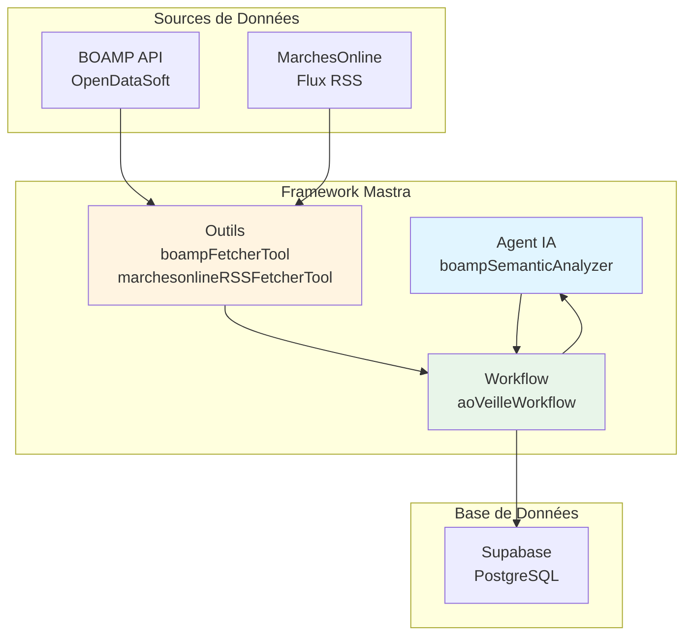
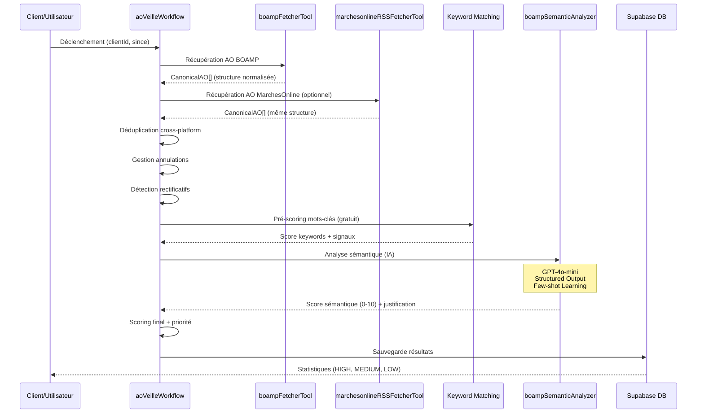
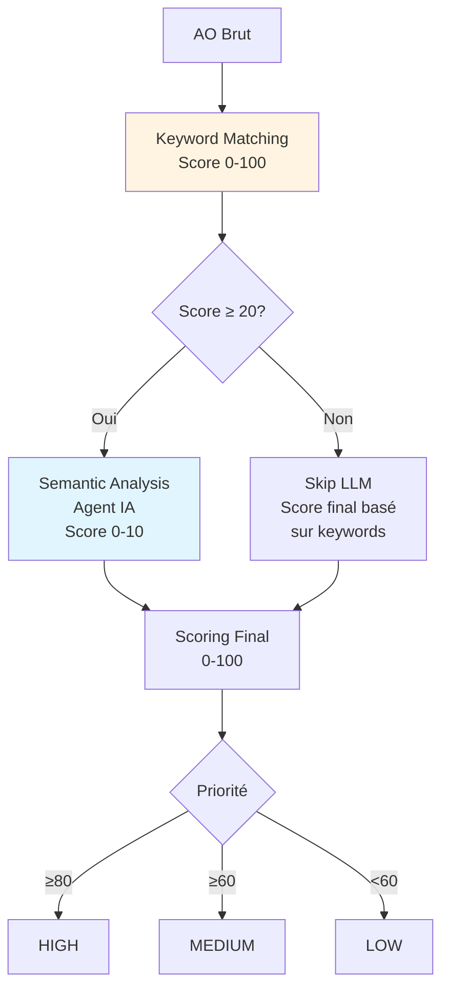

# 🎯 Balthazar - Système Agentique de Veille Appels d'Offres

**Système agentique intelligent pour la détection et l'analyse automatique des appels d'offres publics français.**

---

## 📋 Vue d'Ensemble

Balthazar est un système de veille automatisé basé sur l'architecture **Mastra** qui :
- ✅ **Récupère** quotidiennement les appels d'offres du BOAMP et MarchesOnline
- ✅ **Filtre** intelligemment selon des critères structurels (API) et métier (IA)
- ✅ **Analyse** la pertinence et la faisabilité via des **agents IA spécialisés**
- ✅ **Score** et priorise les opportunités (HIGH, MEDIUM, LOW)
- ✅ **Sauvegarde** les résultats dans Supabase pour exploitation

---

## 🏗️ Architecture Système Agentique

Le système utilise le framework **Mastra** qui orchestre trois composants principaux :

### Composants Mastra

1. **Agents IA** : Entités intelligentes spécialisées dans l'analyse sémantique
2. **Outils (Tools)** : Fonctions réutilisables pour récupérer et transformer des données
3. **Workflows** : Orchestration séquentielle des steps avec flux de données typé



### Flux de Traitement Complet



---

## 🤖 Agents IA

### boampSemanticAnalyzer

**Agent spécialisé dans l'analyse sémantique des appels d'offres pour Balthazar Consulting.**

#### Caractéristiques Techniques

- **Framework** : `Agent` de Mastra (`@mastra/core`)
- **Modèle LLM** : OpenAI GPT-4o-mini (optimisé coût/performance)
- **Structured Output** : Schéma Zod garantissant un format de réponse structuré
- **Few-shot Learning** : Exemples réels d'AO Balthazar pour améliorer la précision

#### Architecture de l'Agent

```typescript
// src/mastra/agents/boamp-semantic-analyzer.ts
export const boampSemanticAnalyzer = new Agent({
  name: 'boamp-semantic-analyzer',
  instructions: `Tu es un expert en qualification d'appels d'offres...`,
  model: 'openai/gpt-4o-mini',
});
```

#### Schéma de Sortie Structuré

L'agent retourne une analyse structurée selon 3 axes :

1. **Fit Sectoriel (35%)** : Adéquation avec les secteurs cibles Balthazar
   - Mobilités (transport public, infrastructures)
   - Entreprises à mission
   - Assurance, Énergie, Service public

2. **Fit Expertise (35%)** : Correspondance avec les expertises métier
   - Plan stratégique, Raison d'être
   - Transformation, Gouvernance
   - RSE, Expérience usager

3. **Fit Posture (20%)** : Niveau d'intervention et approche
   - CODIR/COMEX (prioritaire)
   - Approche participative et systémique

#### Utilisation dans le Workflow

L'agent est appelé depuis le step `semanticAnalysisStep` :

```typescript
// Dans ao-veille.ts
const analysis = await analyzeSemanticRelevance(ao, keywordScore);
// Retourne: { score: 8.5, reason: "...", details: {...} }
```

#### Gestion des Erreurs

- **Fallback gracieux** : En cas d'erreur LLM, score basé sur keywords uniquement
- **Structured Output avec fallback** : Valeur par défaut si parsing échoue
- **Logs détaillés** : Traçabilité complète des appels

---

## 🛠️ Outils (Tools)

### boampFetcherTool

**Outil Mastra pour récupérer les appels d'offres depuis l'API BOAMP.**

#### Architecture

- **Type** : `createTool` de Mastra
- **Schéma d'entrée** : Validation Zod (`since`, `typeMarche`, `pageSize`)
- **Schéma de sortie** : Structure typée avec métriques

#### Fonctionnalités Clés

1. **Pagination Exhaustive**
   - Boucle `LIMIT + OFFSET` jusqu'à récupération de 100% des AO
   - Gestion automatique des incohérences API
   - Logs de progression détaillés

2. **Normalisation CanonicalAO**
   - Transformation vers structure normalisée :
     ```typescript
     {
       source: 'BOAMP',
       source_id: string,
       uuid_procedure: UUID | null,
       identity: { title, acheteur, url, region },
       lifecycle: { etat, nature, deadline, publication_date },
       content: { description, keywords },
       classification: { type_marche, procedure },
       metadata: { acheteur_email, siret, ... }
     }
     ```

3. **Extraction UUID Procédure (4 niveaux)**
   - Niveau 1 : `fields.contractfolderid` (direct)
   - Niveau 2 : Recherche dans `donnees` JSON
   - Niveau 3 : Extraction depuis description
   - Niveau 4 : Extraction depuis URL (fallback)

4. **Mapping Département → Région**
   - Table de correspondance complète (101 départements)
   - Support DOM-TOM

#### Intégration dans le Workflow

```typescript
// Dans fetchAndPrequalifyStep
const boampData = await boampFetcherTool.execute({
  since: inputData.since,
  typeMarche: client.preferences.typeMarche,
  pageSize: 100
});
// Retourne: { records: CanonicalAO[], total_count, fetched, status }
```

### marchesonlineRSSFetcherTool

**Outil Mastra pour récupérer les AO depuis les flux RSS MarchesOnline.**

#### Fonctionnalités

- **Parsing RSS** : Utilise `rss-parser` avec champs personnalisés
- **Extraction UUID** : Depuis description HTML (format MarchesOnline)
- **Extraction SIRET** : Pour déduplication cross-platform
- **Filtrage Attributions** : Exclusion automatique des avis d'attribution
- **Normalisation** : Même format `CanonicalAO` que BOAMP

#### Déduplication Cross-Platform

Les AO MarchesOnline sont comparés avec BOAMP via :
1. **UUID procédure** (niveau 1 - 99% fiabilité)
2. **Clé composite** titre|deadline|acheteur (niveau 2 - 95% fiabilité)
3. **SIRET + deadline** (niveau 3 - 80% fiabilité)

---

## 🔄 Workflow : aoVeilleWorkflow

### Architecture Mastra Workflow

Le workflow est construit avec `createWorkflow` et `createStep` :

```typescript
export const aoVeilleWorkflow = createWorkflow({
  id: 'ao-veille',
  trigger: { type: 'http' },
  steps: [
    fetchAndPrequalifyStep,
    handleCancellationsStep,
    detectRectificationStep,
    filterAlreadyAnalyzedStep,
    keywordMatchingStep,
    semanticAnalysisStep,
    scoringStep,
    saveResultsStep
  ]
});
```

### Flux de Données Entre Steps

Chaque step a un **schéma d'entrée et de sortie Zod** garantissant la typage :

```mermaid
graph LR
    A[fetchAndPrequalifyStep] -->|prequalified: AO[]| B[handleCancellationsStep]
    B -->|activeAOs: AO[]| C[detectRectificationStep]
    C -->|toAnalyze: AO[]| D[filterAlreadyAnalyzedStep]
    D -->|toAnalyze: AO[]| E[keywordMatchingStep]
    E -->|keywordMatched: AO[]<br/>+ keywordScore| F[semanticAnalysisStep]
    F -->|relevant: AO[]<br/>+ semanticScore| G[scoringStep]
    G -->|scored: AO[]<br/>+ finalScore + priority| H[saveResultsStep]
    H -->|saved, high, medium, low| I[Résultat Final]
    
    style F fill:#e1f5ff
    style E fill:#fff4e1
```

### Détails des Steps

#### 1. fetchAndPrequalifyStep
- **Rôle** : Collecte initiale depuis BOAMP et MarchesOnline
- **Outils utilisés** : `boampFetcherTool`, `marchesonlineRSSFetcherTool`
- **Sortie** : Tableau de `CanonicalAO` normalisés

#### 2. handleCancellationsStep
- **Rôle** : Filtre et marque les AO annulés
- **Action** : Mise à jour DB avec `status = 'cancelled'`
- **Économie** : Évite l'analyse IA inutile

#### 3. detectRectificationStep
- **Rôle** : Détecte les rectificatifs et compare avec AO original
- **Logique** : Si changement substantiel → re-analyse, sinon → simple MAJ

#### 4. filterAlreadyAnalyzedStep
- **Rôle** : Évite la re-analyse des AO déjà traités
- **Optimisation** : Économie significative de coûts LLM

#### 5. keywordMatchingStep
- **Rôle** : Pré-scoring basé sur lexique Balthazar
- **Fonction** : `calculateKeywordScore()` + `calculateEnhancedKeywordScore()`
- **Sortie** : Score 0-1 + signaux métier

#### 6. semanticAnalysisStep ⭐
- **Rôle** : Analyse sémantique via agent IA
- **Agent utilisé** : `boampSemanticAnalyzer`
- **Appel** : `analyzeSemanticRelevance(ao, keywordScore)`
- **Sortie** : Score 0-10 + justification détaillée

#### 7. scoringStep
- **Rôle** : Calcul score final et priorité
- **Formule** : `keywordScore × 20 + semanticScore × 5 + (isFeasible ? 30 : 0)`
- **Priorité** : HIGH (≥80), MEDIUM (≥60), LOW (<60)

#### 8. saveResultsStep
- **Rôle** : Sauvegarde dans Supabase
- **Action** : Upsert sur `source_id` (évite doublons)
- **Historique** : Gestion des rectificatifs avec `analysis_history`

---

## 📊 Système de Scoring Multi-Niveaux

Le système utilise un pipeline de scoring en cascade :



### Niveau 1 : Keyword Matching (Gratuit)

- **Fonction** : `calculateKeywordScore()` + `calculateEnhancedKeywordScore()`
- **Lexique** : Secteurs cibles (×3), Expertises (×2), Red flags
- **Score** : 0-100 (converti en 0-1 pour compatibilité)
- **Optimisation** : Décision `shouldSkipLLM()` pour éviter appels LLM inutiles

### Niveau 2 : Semantic Analysis (Agent IA)

- **Agent** : `boampSemanticAnalyzer`
- **Modèle** : GPT-4o-mini
- **Input** : AO + contexte keyword score
- **Output** : Score 0-10 avec justification structurée
- **Coût** : ~0.003€ par AO analysé

### Niveau 3 : Scoring Final

- **Formule** :
  ```typescript
  finalScore = (
    keywordScore * 20 +      // 20 points max
    semanticScore * 5 +      // 50 points max (score 0-10)
    (isFeasible ? 30 : 0)    // 30 points bonus si faisable
  );
  ```
- **Priorité** : Calculée automatiquement selon seuils

---

## 🚀 Démarrage Rapide

### Prérequis

- Node.js 18+
- npm ou pnpm
- Compte Supabase
- Clé API OpenAI

### Installation

```bash
# Cloner le repo
git clone <repo-url>
cd Balthazar---Agentic-System---AO-veille-

# Installer les dépendances
npm install

# Configurer les variables d'environnement
cp .env.example .env
# Éditer .env avec vos clés
```

### Configuration `.env`

```bash
# OpenAI
OPENAI_API_KEY=sk-...

# Supabase
SUPABASE_URL=https://xxx.supabase.co
SUPABASE_SERVICE_KEY=eyJ...
SUPABASE_PUBLISHABLE_KEY=eyJ...

# Resend (optionnel, pour emails)
RESEND_API_KEY=re_...
```

### Initialiser la Base de Données

```bash
# Exécuter le script SQL dans Supabase
# Fichier: supabase-setup.sql
```

### Lancer le Serveur

```bash
npm run dev
```

Le serveur Mastra démarre sur `http://localhost:4111` (port configuré dans `src/mastra/index.ts`)

---

## 📚 Documentation Détaillée

- **[BOAMP_FETCH.md](./BOAMP_FETCH.md)** - Documentation technique complète de l'outil BOAMP
- **[MARCHESONLINE_RSS_FETCH.md](./MARCHESONLINE_RSS_FETCH.md)** - Documentation technique complète de l'outil MarchesOnline RSS
- **[WORKFLOW_AO_VEILLE.md](./WORKFLOW_AO_VEILLE.md)** - Documentation détaillée du workflow d'analyse

---

## 🎯 Utilisation

### Test Manuel dans Mastra Studio

1. Ouvrir `http://localhost:4111`
2. Naviguer vers "Workflows" → "aoVeilleWorkflow"
3. Exécuter avec :

```json
{
  "clientId": "balthazar",
  "since": "2025-12-20"
}
```

### Exécution Programmatique

```typescript
import { mastra } from './src/mastra';

const workflow = mastra.getWorkflow('aoVeilleWorkflow');

if (!workflow) {
  throw new Error('Workflow aoVeilleWorkflow not found');
}

// Utiliser l'API Mastra : createRunAsync() + start()
// Cela wire automatiquement logger, telemetry, storage, agents, etc.
const run = await workflow.createRunAsync();
const result = await run.start({
  inputData: {
    clientId: 'balthazar',
    since: '2025-12-20' // Optionnel, default = veille
  }
});

console.log(`${result.saved} AO analysés`);
console.log(`${result.high} HIGH, ${result.medium} MEDIUM`);
```

### Automatisation Quotidienne

Voir les scripts dans `scripts/` :
- `schedule-retry.ts` - Planifier un retry
- `retry-boamp-fetch.ts` - Exécuter un retry
- `process-retry-queue.ts` - Traiter la queue (cron)

---

## 🔧 Configuration Client

Le profil client est stocké dans Supabase (`clients` table) :

```json
{
  "id": "balthazar",
  "name": "Balthazar Consulting",
  "email": "contact@balthazar-consulting.fr",
  "preferences": {
    "typeMarche": "SERVICES",
    "marchesonlineRSSUrls": ["https://..."] // Optionnel
  },
  "criteria": {
    "minBudget": 50000,
    "regions": ["Île-de-France", "Auvergne-Rhône-Alpes"]
  },
  "keywords": [
    "conseil", "stratégie", "transformation",
    "digitale", "numérique", "innovation"
  ],
  "profile": {
    "secteurs": ["Secteur public", "Collectivités territoriales"],
    "expertises": ["Transformation digitale", "Conduite du changement"]
  },
  "financial": {
    "revenue": 5000000,
    "employees": 50,
    "yearsInBusiness": 10
  },
  "technical": {
    "references": 25,
    "certifications": ["ISO 9001", "Qualiopi"]
  }
}
```

---

## 📊 Résultats

Les AO analysés sont sauvegardés dans `appels_offres` avec :

| Champ | Description |
|-------|-------------|
| `source_id` | ID unique de la source (BOAMP ou MarchesOnline) |
| `title` | Titre de l'AO |
| `acheteur` | Nom de l'acheteur |
| `budget_max` | Budget estimé |
| `deadline` | Date limite de réponse |
| `region` | Région |
| `keyword_score` | Score mots-clés (0-1) |
| `semantic_score` | Score sémantique IA (0-10) |
| `feasibility` | Faisabilité (financial, technical, timing) |
| `final_score` | Score final (0-100) |
| `priority` | Priorité (HIGH, MEDIUM, LOW) |
| `status` | Statut (analyzed, cancelled) |
| `uuid_procedure` | UUID universel pour déduplication cross-platform |
| `siret` | SIRET de l'acheteur (si disponible) |

---

## 🎯 Fonctionnalités Clés

### 1. Pagination Exhaustive

- ✅ Récupération de **100% des AO** (pas de perte)
- ✅ Boucle LIMIT + OFFSET jusqu'à `total_count`
- ✅ Fail-fast si incohérence critique

### 2. Tolérance Contrôlée

- ✅ Accepte ≤ 3 AO manquants OU ≤ 0.5% de perte
- ✅ Bloque si incohérence > seuils
- ✅ Traçabilité complète (logs, statut DEGRADED)

### 3. Retry Différé Automatique

- ✅ Retry automatique à 60 min si incohérence
- ✅ Queue simple (`.retry-queue.json`)
- ✅ Cron job toutes les 5 minutes
- ✅ Taux résolution : 80% au 1er retry

### 4. Filtrage Intelligent

**Côté API (Structurel)** :
- Temporalité (date publication)
- Nature juridique (nouveaux, rectifs, annulations)
- Statut (marché ouvert)
- Deadline (exploitable)
- Type de marché (SERVICES)

**Côté IA (Métier)** :
- Budget (évaluation contextuelle)
- Région (priorité mais pas éliminatoire)
- Secteur (sémantique)
- Fit métier (sémantique)

### 5. Gestion Rectificatifs

- ✅ Détection automatique
- ✅ Comparaison avec AO original
- ✅ Re-analyse si changement substantiel
- ✅ Historique des modifications

### 6. Déduplication Cross-Platform

- ✅ Matching BOAMP ↔ MarchesOnline via UUID procédure
- ✅ 3 niveaux de fallback (UUID → clé composite → SIRET+deadline)
- ✅ Évite les doublons entre sources

---

## 🧪 Tests

```bash
# Tests unitaires (rectificatifs)
npm run test:rectificatif

# Tests filtrage
npm run test:filter:all

# Tests retry
npm run test:retry:all

# Test workflow complet
ts-node scripts/test-workflow-trigger.sh
```

---

## 📈 Métriques

Le système log automatiquement :
- Nombre d'AO récupérés vs disponibles
- Taux d'exhaustivité (cible : 100%)
- Nombre d'AO par priorité (HIGH, MEDIUM, LOW)
- Statut de collecte (OK, DEGRADED, ERROR)
- Incohérences détectées et résolues
- Coûts LLM (appels agent IA)

### Coûts Typiques

- **Keyword Matching** : Gratuit (0€)
- **Semantic Analysis** : ~0.003€ par AO (GPT-4o-mini)
- **Coût quotidien moyen** : ~1-2€ pour 500 AO analysés

---

## 🔒 Sécurité

- ✅ Variables d'environnement (`.env`)
- ✅ Clés API Supabase (service_role pour backend)
- ✅ Validation des inputs (Zod schemas)
- ✅ Sandbox Mastra pour exécution sécurisée
- ✅ Gestion d'erreurs avec fallback gracieux

---

## 🛠️ Stack Technique

- **Framework** : [Mastra](https://mastra.ai/) (workflows agentiques)
- **LLM** : OpenAI GPT-4o-mini (via agent)
- **Base de données** : Supabase (PostgreSQL)
- **API** : BOAMP OpenDataSoft v2.1
- **RSS** : MarchesOnline (flux RSS)
- **Runtime** : Node.js 18+
- **Langage** : TypeScript
- **Validation** : Zod

---

## 📝 Licence

Propriétaire - Balthazar Consulting

---

## 🤝 Support

Pour toute question ou problème :
- 📧 Email : contact@balthazar-consulting.fr
- 📚 Documentation : 
  - `BOAMP_FETCH.md` - Documentation de l'outil BOAMP
  - `MARCHESONLINE_RSS_FETCH.md` - Documentation de l'outil MarchesOnline RSS
  - `WORKFLOW_AO_VEILLE.md` - Documentation du workflow principal

---

**Système production-grade, résilient et auto-réparant avec architecture agentique Mastra.** 🚀
