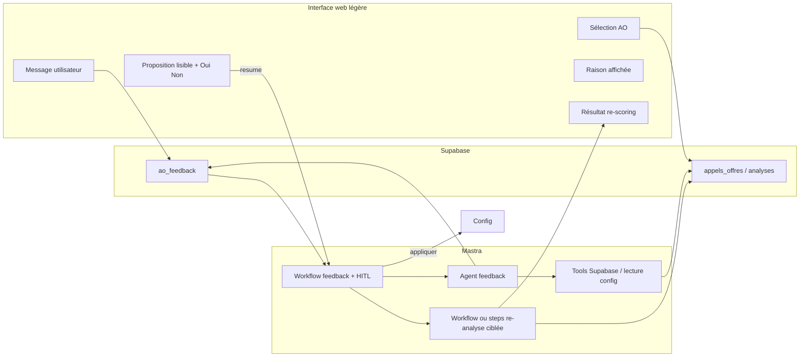

# Vision produit : feedback métier sur les AO — interface simple, agent, re-scoring ciblé

Document de cadrage pour l’équipe technique. Il décrit la vision fonctionnelle, les prérequis données, l’architecture cible, et **quelles briques Mastra utiliser à chaque étape**. Les références Mastra citées correspondent à la documentation officielle actuelle ([Suspend & Resume](https://mastra.ai/docs/workflows/suspend-and-resume), [Human-in-the-loop](https://mastra.ai/docs/workflows/human-in-the-loop), [RAG overview](https://mastra.ai/docs/rag/overview)) ; à valider contre la version installée du projet (`@mastra/core` ^0.24.x au moment de la rédaction).

---

## 1. Objectif

Permettre à un utilisateur métier (ex. Pablo) de :

1. **Sélectionner un appel d’offres (AO) précis** dans une interface minimale.
2. **Lire pourquoi le système l’a classé comme il l’a fait** (accepté, refusé, priorité, etc.) — en langage **compréhensible**, pas en jargon technique.
3. **Expliquer en langage naturel** ce qu’il aurait voulu : *« ça aurait dû passer »*, *« ça n’aurait pas dû passer »*, ou nuancer (faux positif / faux négatif).
4. Recevoir de la part d’un **agent** une **proposition de règle** exprimée simplement (français ou anglais, **même langue que l’utilisateur**), après vérification contre **keywords** et **base RAG / corpus** existants (éviter doublons et overlaps).
5. **Confirmer ou refuser** explicitement l’application de cette proposition.
6. Après application (si confirmée), **relancer l’analyse uniquement sur les AO sélectionnés** pour comparer avant / après (statut, score, message court).

**Principe non négociable :** aucune modification durable des règles (keywords, corpus, index vectoriel) sans **validation explicite** de l’utilisateur.

---

## 2. Public et principes UX

| Principe | Détail |
|----------|--------|
| Simplicité | Peu d’écrans : liste / recherche d’AO → détail « pourquoi » → champ libre → proposition lisible → Oui / Non → optionnellement résultat du re-scoring. |
| Langage | Titres et explications **métier** ; pas de noms de fichiers, d’IDs de chunk, ni termes du type « embedding » dans le message principal (réservé à une section « détail technique » optionnelle pour les devs). |
| Bilinguisme | Détection ou préférence : l’agent formule la « règle expliquée » dans la langue du message utilisateur (FR / EN minimum). |
| Confiance | Montrer **l’impact pour les prochains AO** en une ou deux phrases (« à partir de maintenant, on sera plus strict sur… »). |

---

## 3. Prérequis données (indispensable pour la qualité)

Sans ces éléments, l’agent **reconstruit** la vérité et peut se tromper.

### 3.1 Au moment de l’analyse veille (pipeline existant)

Persister pour chaque AO analysé (ou pour les cas « intéressants » : envoyés par email, au-dessus d’un seuil, etc.) :

- **Statut / priorité** final (`HIGH` / `MEDIUM` / `LOW` / `CANCELLED`, etc.).
- **`human_readable_reason`** : texte court affichable dans l’UI (ex. « Écarté : aucun lien clair avec le conseil stratégique », « Accepté : bon alignement secteur + posture CODIR »).
- **`machine_trace`** (JSON) : tout ce qui sert au diagnostic sans ambiguïté, par exemple :
  - score keywords, breakdown (secteur / expertise / posture),
  - liste des keywords / red flags matchés avec scores ou libellés,
  - indicateur « LLM skippé ou non » et pourquoi,
  - extrait structuré de la sortie agent (`semanticReason`, `decision_gate`, `rejet_raison`, `rag_sources`, etc.).

Le workflow actuel produit déjà une grande partie de cette information dans les steps (`keywordMatchingStep`, `analyzeOneAOSemanticStep`, `scoreOneAOStep`, `processOneAOWorkflow`) — il s’agit de **l’écrire en base** de façon stable pour l’UI feedback.

### 3.2 Table `ao_feedback` (déjà créée côté Supabase)

À formaliser dans ce document métier (colonnes indicatives) :

- Référence AO (`source_id` / clé métier).
- Texte utilisateur, horodatage, auteur (si compte plus tard).
- **État du cycle** : `draft` → `agent_proposed` → `awaiting_user_confirm` → `applied` | `rejected` | `cancelled`.
- **Lien vers exécution Mastra** : `workflow_run_id` / `mastra_run_id` si vous suspendez un workflow pour HITL (voir section 6).
- Payload JSON : proposition structurée (type de changement : red flag, keyword, chunk RAG, seuil…), version pour audit.

---

## 4. Architecture logique (composants)



- **Interface** : application minimale (Vercel, ou page hébergée ailleurs) qui appelle des **routes HTTP** exposées par le serveur Mastra (ou un BFF Node) — pas obligatoire que toute la UI soit « dans » Mastra.
- **Supabase** : source de vérité des AO, des traces d’analyse, des lignes `ao_feedback`.
- **Mastra** : orchestration du raisonnement agent, **suspend/resume** pour la confirmation humaine, réutilisation ou factorisation du pipeline de scoring pour le **re-run ciblé**.

---

## 5. Mastra : quoi utiliser à chaque étape (priorités)

Le tableau ci-dessous est la **carte de travail** pour l’implémentation. Les noms d’API (`createStep`, `suspend`, `resume`, `bail`, etc.) sont ceux documentés officiellement ; vérifier les signatures exactes dans la version `@mastra/core` du repo via le **MCP Mastra** (voir section 8).

| Étape fonctionnelle | Rôle | Briques Mastra recommandées | Notes d’implémentation dans Balthazar |
|---------------------|------|----------------------------|----------------------------------------|
| **A. Capture** (sélection AO + message utilisateur) | Persister l’intention métier | Optionnel : pas d’agent. **HTTP route** + client Supabase depuis le serveur, ou **Tool** dédié `insertFeedback` appelé par un mini-agent si vous uniformisez tout via Mastra. | La table `ao_feedback` est déjà le bon dépôt. |
| **B. Chargement contexte** | Récupérer AO + trace « pourquoi » + keywords / RAG | **Workflow `createStep`** sans LLM : étapes déterministes ; **Tools** (`createTool`) pour `getAoById`, `getLatestAnalysis`, `listKeywordsSnapshot`, `searchRagCorpus` / lecture fichier versionné si encore en repo. | Aujourd’hui : keywords dans le code (`balthazar-keywords.ts`), RAG via outils dans `balthazar-rag-tools.ts` et agent `boampSemanticAnalyzer`. Le feedback doit **lire la même vérité** que la veille (fichier, DB, ou snapshot exporté). |
| **C. Raisonnement métier** | Comprendre la demande, détecter overlap, formuler une proposition **en langage simple** | **`Agent`** (`Agent` de `@mastra/core`) avec **instructions** fortes sur le ton (pas de jargon) et **sortie structurée** (`zod` / `structuredOutput`) : champs `userFacingRule_fr`, `userFacingRule_en`, `changeType`, `technicalPayload`, `conflictsWithExisting`. | Agent **séparé** de `boampSemanticAnalyzer` (rôle différent : tuning des règles, pas scoring d’un AO). |
| **D. Confirmation utilisateur** | Bloquer tant que l’utilisateur n’a pas dit Oui / Non | **`createWorkflow` + `createStep`** avec **`suspend()`** / **`resume()`** et **`resumeSchema`** (ex. `{ decision: 'approve' \| 'reject' }`). Utiliser **`suspendSchema`** pour exposer à l’UI le texte à afficher (proposition, résumé impact). Utiliser **`bail()`** si l’utilisateur refuse, pour terminer proprement sans erreur. | Doc : [Human-in-the-loop](https://mastra.ai/docs/workflows/human-in-the-loop). Stocker `runId` + step suspendu dans `ao_feedback` pour que le bouton « Confirmer » du front appelle `POST /.../resume`. |
| **E. Application** | Écrire la règle (DB, fichier, ou PR Git) | **Step(s) déterministes** après resume positif : pas besoin de LLM. Éventuellement **Tools** `applyRedFlagToDb`, `upsertCorpusChunk`, `triggerReindex`. | Décision produit : overrides en **Supabase** (simple pour l’agent) vs **commit Git** (versionning natif, plus de friction CI). |
| **F. Re-scoring ciblé** | Rejouer le pipeline sur **N AO** uniquement | **`createWorkflow`** dédié `feedback-recheck-workflow` qui : (1) charge la config à jour, (2) pour chaque AO id en entrée, enchaîne les mêmes étapes que `processOneAOWorkflow` / `analyzeAOCompleteWorkflow` (ou **workflow imbriqué** `.then(existingSubWorkflow)`), (3) écrit résultats comparatifs. | Aujourd’hui la logique riche est dans `src/mastra/workflows/ao-veille.ts` — **factoriser** ou **appeler** le sous-workflow existant évite la dérive. |
| **G. Planification / file d’attente** | Ne pas bloquer l’UI sur le LLM long | **Inngest** (déjà utilisé pour la veille) : événement `ao.feedback.submitted` → step qui démarre le workflow feedback. | Même pattern que `src/mastra/inngest/index.ts` + `mastra.getWorkflow(...)`. |

### 5.1 Agent existant vs agent feedback

- **`boampSemanticAnalyzer`** : qualification d’un AO (axes fit, `decision_gate`, RAG policies / case studies). **Ne pas surcharger** avec la logique « modification des règles ».
- **Nouvel agent (nom indicatif `aoFeedbackTuningAgent`)** : entrée = texte utilisateur + contexte AO + extrait keywords/corpus ; sortie = proposition structurée + formulation utilisateur. Tools orientés **lecture** et **recherche de doublons** (requêtes vectorielles ou grep sur liste de keywords selon votre stockage).

### 5.2 RAG et réindexation

- Si le corpus reste dans **pgvector** / `@mastra/pg` : après ajout de chunks, enchaîner **embed + upsert** selon le modèle d’embedding documenté ([RAG overview](https://mastra.ai/docs/rag/overview)).
- L’agent feedback peut avoir un **tool** « rechercher des chunks similaires à cette formulation » pour détecter l’overlap **avant** de proposer un nouveau chunk.

### 5.3 Branching dans le workflow feedback

- Utiliser **`.branch()`** si plusieurs types de correction mènent à des chemins différents (ex. seulement keyword vs keyword + reindex RAG), comme pour `processOneAOWorkflow` dans `ao-veille.ts`.

---

## 6. Flux détaillé avec suspend / resume (HITL)

Séquence recommandée (alignée sur la doc Mastra) :

1. **Start** : `feedbackWorkflow.createRun()` avec `inputData` : `{ feedbackId, aoId, userMessage }`.
2. **Step « enrich »** : charge AO + trace + snippets keywords/RAG (pas de suspend).
3. **Step « agent-propose »** : appelle `aoFeedbackTuningAgent.generate(...)` (ou équivalent) ; persiste la proposition sur `ao_feedback` ; prépare le texte utilisateur.
4. **Step « user-confirm »** :
   - Si pas encore de `resumeData.approved` → **`return suspend({ ... })`** avec `suspendSchema` contenant au minimum : titre court, corps de la proposition, langue, et lien / id pour reprendre.
   - L’API HTTP du serveur Mastra (ou route custom) renvoie au front : `status: suspended`, `runId`, `suspendPayload`.
5. **Front** : affiche les boutons ; appelle **`run.resume({ step: 'user-confirm', resumeData: { approved: true } })`** ou `false`.
6. **Si `approved === false`** : **`bail({ reason: '...' })`** et marquer `ao_feedback.rejected`.
7. **Si approved** : step « apply » puis « recheck » (optionnel selon case à cocher « relancer l’analyse sur cet AO »).

Les **snapshots** de workflow (stockage Mastra) assurent la reprise après redémarrage — pertinent pour Mastra Cloud. Voir [Suspend & Resume](https://mastra.ai/docs/workflows/suspend-and-resume).

---

## 7. Re-scoring ciblé (spécification)

- **Entrée** : liste d’`ao_id` / `source_id`, option `includeNeighbors` (futur), flag `useDraftRules` si vous prévisualisez avant commit.
- **Sortie** : pour chaque AO, `{ avant: { priority, score, reason }, après: { ... }, changed: boolean }`.
- **Implémentation** : réutiliser **`processOneAOWorkflow`** ou extraire une fonction « run analysis from raw ao row » pour éviter deux vérités.
- **Coût** : le re-run peut invoquer le LLM ; limiter N (ex. max 10 AO par action) et journaliser les coûts.

---

## 8. MCP Mastra (`@mastra/mcp-docs-server`) — usage pour l’équipe

Dans Cursor, le serveur MCP est configuré pour lancer :

```json
"npx -y @mastra/mcp-docs-server@latest"
```

(conformément à votre `mcp.json` : commande `npx` + package `@mastra/mcp-docs-server`.)

**À faire pendant le développement de cette feature :**

1. **`searchMastraDocs`** / **`readMastraDocs`** avec `projectPath` = **racine du repo** contenant `node_modules/@mastra/*`, pour coller à **la version installée** (éviter les API obsolètes).
2. En cas d’échec de découverte des packages (environnement sans `node_modules`), consulter [mastra.ai/docs](https://mastra.ai/docs) et valider par exécution locale (`npm run dev`, Mastra Studio sur le port du projet).

**Sujets à requêter explicitement dans le MCP pendant l’implémentation :**

- `createWorkflow`, `createStep`, `suspend`, `resume`, `bail`, `suspendSchema`, `resumeSchema`
- `nested workflow`, `branch`, `foreach` (si re-scoring par lot)
- `Agent`, `tools`, structured output / `z.object`
- RAG : `MDocument`, chunking, `PgVector` / vector store utilisé par Balthazar
- Déploiement Mastra Cloud + persistance des snapshots si applicable

---

## 9. Sécurité et robustesse

| Sujet | Recommandation |
|-------|----------------|
| Accès à l’UI | Auth légère (magic link, SSO ultérieur) ; ne pas exposer les AO par simple id séquentiel sans token signé. |
| Idempotence | Empêcher double application : contrainte unique ou état `applied` + transaction. |
| Qualité LLM | Même avec confirmation, une proposition peut être **fausse** ; le diagnostic factuel (section 3.1) réduit le risque. |
| Audit | Garder l’historique des règles ajoutées (qui, quand, quel `feedbackId`). |

---

## 10. Décisions ouvertes (à trancher en atelier)

1. **Source de vérité des overrides** : table Supabase « règles actives » lue par `keywordMatchingStep` vs modification des fichiers du repo via GitHub API.
2. **Où vit le corpus** : uniquement vector store vs `balthazar_corpus.jsonl` + job d’ingestion ; impact direct sur l’étape « réindexer ».
3. **Email** : lien profond vers l’UI de feedback (token signé) en complément de la sélection manuelle d’AO.
4. **Fréquence** : traitement feedback en temps quasi réel (webhook) vs batch Inngest.

---

## 11. Fichiers du dépôt pertinents aujourd’hui

| Fichier | Rôle |
|---------|------|
| `src/mastra/index.ts` | Enregistrement `mastra` : agents + workflows ; `apiRoutes` (ex. étendre pour HITL / feedback). |
| `src/mastra/workflows/ao-veille.ts` | Pipeline veille, `processOneAOWorkflow`, `analyzeAOCompleteWorkflow`, keywords, scoring. |
| `src/mastra/agents/boamp-semantic-analyzer.ts` | Agent sémantique RAG actuel (référence pour traces à persister). |
| `src/mastra/tools/balthazar-rag-tools.ts` | Outils RAG existants — modèle pour les tools « lecture / recherche overlap ». |
| `src/mastra/inngest/index.ts` | Pattern Inngest + `mastra.getWorkflow` pour jobs asynchrones. |
| `INNGEST.md` | Rappel config cron / URL `/api/inngest`. |

---

## 12. Résumé exécutif pour priorisation backlog

1. **Persister** trace humaine + machine à la fin de l’analyse veille (bloquant pour une UI honnête).
2. **Workflow feedback** avec **Agent dédié** + **suspend/resume** pour confirmation.
3. **Tools** de lecture Supabase + inspection keywords/corpus + détection overlap.
4. **Couche apply** (DB ou Git) + **workflow re-scoring ciblé** branché sur la même logique que `ao-veille`.
5. **Inngest** (optionnel au début) pour découpeler soumission lourde / retries.

Ce document est la base de discussion avec les développeurs ; il devra être mis à jour après les choix d’architecture (overrides DB vs Git, schéma exact `ao_feedback`, et contrats d’API du front).
